## UML Class Diagram

```mermaid
classDiagram

    class Person {
        <<abstract>>
        #int id
        #string name
        #int age

        +Person()
        +Person(int id, string name, int age)
        +virtual display()*
        +getId() int
    }

    class Faculty {
        -string department
        -double salary
        -int attendanceDays

        +Faculty()
        +Faculty(int id, string name, int age, string department, double salary, int attendanceDays)
        +display()
        +getName() string
        +getAge() int
        +getDepartment() string
        +getSalary() double
        +getAttendance() int
        +markAttendance()
    }

    class FacultyManager {
        -vector~Faculty~ faculties

        +addFaculty()
        +displayAll()
        +searchFaculty()
        +updateFaculty()
        +deleteFaculty()
        +searchByDepartment()
        +markFacultyAttendance()
        +attendanceReport()
        +saveToFile()
        +loadFromFile()
    }

    Person <|-- Faculty
    FacultyManager "1" o-- "0..*" Faculty : manages
```



### Class Relationships

**1. Person → Faculty**

`Faculty` inherits from `Person`.

```text
Person
   ▲
   │ inherits
   │
Faculty
```

The common attributes `id`, `name`, and `age` are defined in `Person` and inherited by `Faculty`.

**2. FacultyManager → Faculty**

`FacultyManager` contains a `vector<Faculty>`:

```cpp
vector<Faculty> faculties;
```

Therefore, one `FacultyManager` can manage **zero or more Faculty objects**.

**3. Person is an Abstract Class**

`Person` contains the pure virtual function:

```cpp
virtual void display() = 0;
```

Therefore, `Person` is an **abstract base class**, and `Faculty` provides its implementation of `display()`.

### OOP Concepts Used

| OOP Concept                 | Implementation                              |
| --------------------------- | ------------------------------------------- |
| **Inheritance**             | `Faculty : public Person`                   |
| **Abstraction**             | `Person` has pure virtual `display()`       |
| **Encapsulation**           | Private/protected data members              |
| **Polymorphism**            | Virtual `display()` overridden by `Faculty` |
| **Composition/Aggregation** | `FacultyManager` manages `vector<Faculty>`  |
