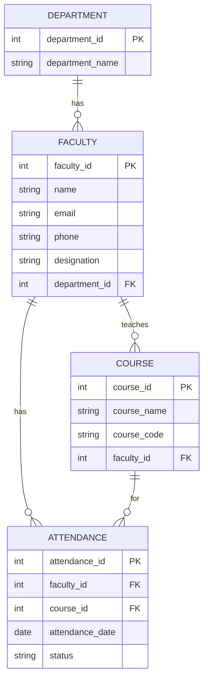

## Entity Relationship Diagram

The Faculty Management System consists of four main entities: **Department, Faculty, Course, and Attendance**.

### Entity Relationships

* **Department → Faculty:** A department can have multiple faculty members, while each faculty member belongs to one department.
* **Faculty → Course:** A faculty member can teach multiple courses.
* **Faculty → Attendance:** A faculty member can have multiple attendance records.
* **Course → Attendance:** Each course can have multiple attendance records.
